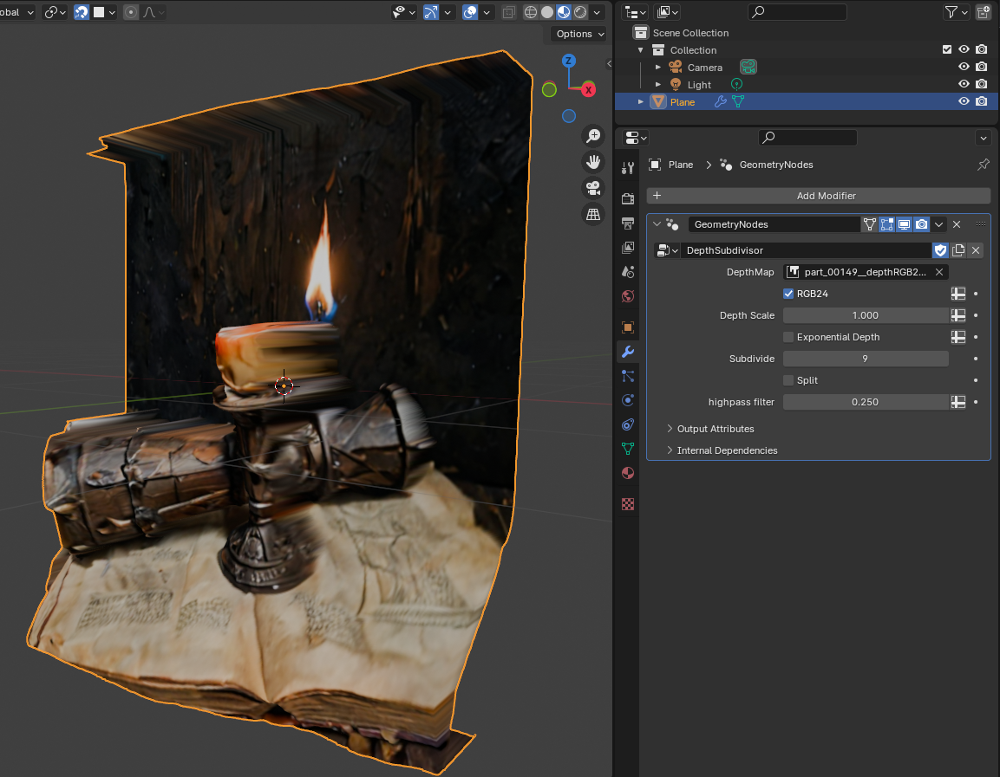

# lib2D5

This repository contains research on applying monocular depth estimators
for practical use with software such as Blender and Godot.

The goal is to create novel|awesome **real-time** visuals.

> Backstory: I was developing a game, but then I fell into  
> a deep rabbit hole trying to bring 2D to life.  


## Blender Geometry Node
**Download:** [geonodes_v3.blend](./geonodes_v3.blend)

The GeometryNode is intended to be applied on a quad, the method itself is quite simple:
- Subdivde the quad 5-10 times
- Re-distribute each vertex along Z-axis by looking up attached depth map.
- (option postprocessing)
    - Apply Smooth modifier
    - Remesh using Quadflow
- In material: use `Emission` shader for texture color




_(rigged &amp; animated mesh as a ready to use `.glb` -asset)_

## Godot 2D5 Fragment Shader

**Download:** [frag2D5.gdshader](./frag2D5.gdshader)

This shader takes depth and a transformation matrix as input (optional normal maps supported).  
Adjust the focal length and displacement multipliers for optimal effect.


**Motion**
- mode0: uniform `mat3 transform` used as input for displacement. (control shader from gdscript)
- mode1: [Wigglegram](https://en.wikipedia.org/wiki/Wiggle_stereoscopy)


### Normals
The shader also supports normals that play well with Godot's [2D illumination engine](https://docs.godotengine.org/en/stable/tutorials/2d/2d_lights_and_shadows.html):


## Godot 3DSDF Fragment Shader

**Download:** [sdf_3d.gdshader](./sdf_3d.gdshader)

A 3d fragment shader with a ray-marching function,
that steps up to the object and then continues micro-stepping
through the surface while sampling the depth-map.


## Generating Depth Maps

There are many ways to generate depth maps from images.
If you already have diffusion set up then try something like [ComfyUi-GeoWizard](https://github.com/kijai/ComfyUI-Geowizard)  

And please help yourself to the pre-generated content in [examples/](./examples) folder.  
They were generated using patched [geowizard/run_infer_v2.py](https://github.com/fuxiao0719/GeoWizard/blob/main/geowizard/run_infer_v2.py):
```  
python run_infer_v2.py --input_dir demo/ --output_dir examples/ --denoise_steps 12 --ensemble_size 3 --processing_res 1024
```

RGB24 patch:
```
from pathlib import Path

def save_depth_maps(depth, output_dir, base_name):
    depth = 1. - depth # https://github.com/kijai/ComfyUI-Geowizard/blob/main/nodes.py#L205C25-L205C40
    
    # 16bit grayscale
    g16 = Image.fromarray((depth * 65535).astype(np.uint16), mode='I;16')
    g16.save(Path(output_dir) / (base_name + '_depthG16.png'))

    # 24bit RGB
    scaled = (depth * (2**24 -1)).astype(np.uint32)
    R = ((scaled >> 16) & 0xff).astype(np.uint8)
    G = ((scaled >> 8) & 0xff).astype(np.uint8)
    B = (scaled & 0xff).astype(np.uint8)
    rgb24 = Image.fromarray(np.stack((R, G, B), axis=-1), mode='RGB')
    rgb24.save(Path(output_dir) / (base_name + '_depthRGB24.png'))

    # 8bit Depth maps
    d8 = (depth * 255).astype(np.uint8)
    rgb8 = Image.fromarray(np.stack((d8, d8, d8), axis=-1))
    rgb8.save(Path(output_dir) / (base_name + '_depthG8.png'))

if __name__=="__main__":
    ...
	
    # Add this line
    save_depth_maps(depth_pred, output_dir, rgb_name_base)
    
    normal_npy_save_path = os.path.join(output_dir_normal_npy, f"{pred_name_base}.npy")
    ...
```

Other models tested:

- Marigold: produces decent depth maps but perspective is always skewed/rounded.
- DepthAnythingV2: Has issues, produces a white rim around objects and diverse noise.
- GeoWizardV1/V2: outputs detailed depth and normals.

## License

All wrongs reversed 🄯 2024 Tony | Decent Labs

---


_(shameless self-promotion)_
<details><summary>release is delayed :'-/</summary>

2D-alpha is playable via keet.io using link:
```
pear://84kw1xcpub8fjiz4hr7o8pe3qryq9hc4iidce157wm3kc5jzg1go
```
and eventually [official website](https://proofofhonor.com) will be up.
</details>


